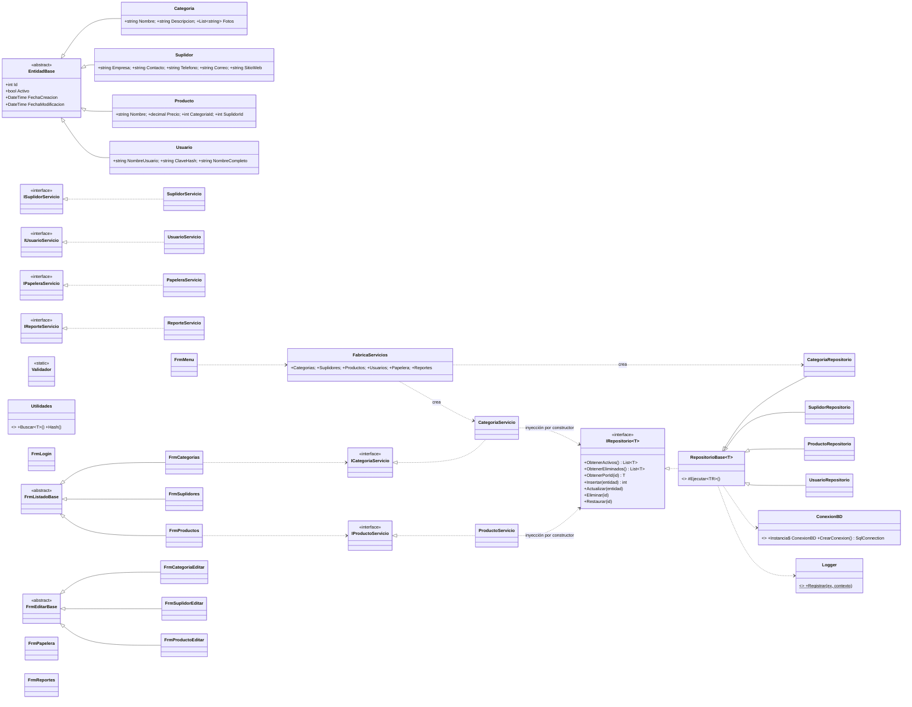

# Diagrama de clases (UML)

> Se visualiza automáticamente en GitHub (Mermaid). También se puede pegar en https://mermaid.live para exportarlo como imagen.

```mermaid
classDiagram
    direction LR

    %% ===== Entidades =====
    class EntidadBase {
        <<abstract>>
        +int Id
        +bool Activo
        +DateTime FechaCreacion
        +DateTime FechaModificacion
    }
    class Categoria { +string Nombre; +string Descripcion; +List~string~ Fotos }
    class Suplidor { +string Empresa; +string Contacto; +string Telefono; +string Correo; +string SitioWeb }
    class Producto { +string Nombre; +decimal Precio; +int CategoriaId; +int SuplidorId }
    class Usuario { +string NombreUsuario; +string ClaveHash; +string NombreCompleto }
    EntidadBase <|-- Categoria
    EntidadBase <|-- Suplidor
    EntidadBase <|-- Producto
    EntidadBase <|-- Usuario

    %% ===== Acceso a datos =====
    class IRepositorio~T~ {
        <<interface>>
        +ObtenerActivos() List~T~
        +ObtenerEliminados() List~T~
        +ObtenerPorId(id) T
        +Insertar(entidad) int
        +Actualizar(entidad)
        +Eliminar(id)
        +Restaurar(id)
    }
    class RepositorioBase~T~ { <<abstract>> #Ejecutar~TR~() }
    class CategoriaRepositorio
    class SuplidorRepositorio
    class ProductoRepositorio
    class UsuarioRepositorio
    class ConexionBD { <<Singleton>> +Instancia$ ConexionBD +CrearConexion() SqlConnection }
    class Logger { <<static>> +Registrar(ex, contexto)$ }
    IRepositorio~T~ <|.. RepositorioBase~T~
    RepositorioBase~T~ <|-- CategoriaRepositorio
    RepositorioBase~T~ <|-- SuplidorRepositorio
    RepositorioBase~T~ <|-- ProductoRepositorio
    RepositorioBase~T~ <|-- UsuarioRepositorio
    RepositorioBase~T~ ..> ConexionBD
    RepositorioBase~T~ ..> Logger

    %% ===== Lógica de negocio =====
    class ICategoriaServicio { <<interface>> }
    class ISuplidorServicio { <<interface>> }
    class IProductoServicio { <<interface>> }
    class IUsuarioServicio { <<interface>> }
    class IPapeleraServicio { <<interface>> }
    class IReporteServicio { <<interface>> }
    class CategoriaServicio
    class SuplidorServicio
    class ProductoServicio
    class UsuarioServicio
    class PapeleraServicio
    class ReporteServicio
    class FabricaServicios { +Categorias; +Suplidores; +Productos; +Usuarios; +Papelera; +Reportes }
    class Validador { <<static>> }
    class Utilidades { <<static>> +Buscar~T~() +Hash() }
    ICategoriaServicio <|.. CategoriaServicio
    ISuplidorServicio <|.. SuplidorServicio
    IProductoServicio <|.. ProductoServicio
    IUsuarioServicio <|.. UsuarioServicio
    IPapeleraServicio <|.. PapeleraServicio
    IReporteServicio <|.. ReporteServicio
    CategoriaServicio ..> IRepositorio~T~ : inyección por constructor
    ProductoServicio ..> IRepositorio~T~ : inyección por constructor
    FabricaServicios ..> CategoriaRepositorio : crea
    FabricaServicios ..> CategoriaServicio : crea

    %% ===== Presentación =====
    class FrmLogin
    class FrmMenu
    class FrmListadoBase { <<abstract>> }
    class FrmEditarBase { <<abstract>> }
    class FrmCategorias
    class FrmSuplidores
    class FrmProductos
    class FrmCategoriaEditar
    class FrmSuplidorEditar
    class FrmProductoEditar
    class FrmPapelera
    class FrmReportes
    FrmListadoBase <|-- FrmCategorias
    FrmListadoBase <|-- FrmSuplidores
    FrmListadoBase <|-- FrmProductos
    FrmEditarBase <|-- FrmCategoriaEditar
    FrmEditarBase <|-- FrmSuplidorEditar
    FrmEditarBase <|-- FrmProductoEditar
    FrmMenu ..> FabricaServicios
    FrmCategorias ..> ICategoriaServicio
    FrmProductos ..> IProductoServicio
```
