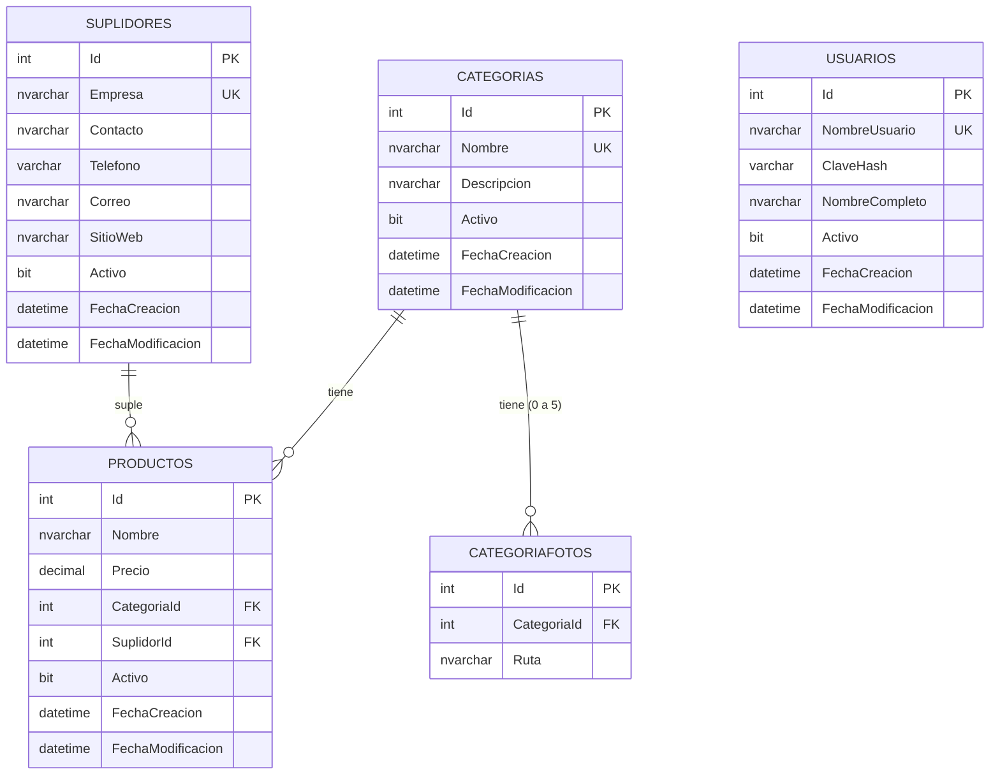

# Diagrama Entidad-Relación

> Se visualiza automáticamente en GitHub (Mermaid). También se puede exportar como imagen desde https://mermaid.live

```mermaid
erDiagram
    CATEGORIAS ||--o{ PRODUCTOS : "tiene"
    SUPLIDORES ||--o{ PRODUCTOS : "suple"
    CATEGORIAS ||--o{ CATEGORIAFOTOS : "tiene (0 a 5)"

    USUARIOS {
        int Id PK
        nvarchar NombreUsuario UK
        varchar ClaveHash
        nvarchar NombreCompleto
        bit Activo
        datetime FechaCreacion
        datetime FechaModificacion
    }
    CATEGORIAS {
        int Id PK
        nvarchar Nombre UK
        nvarchar Descripcion
        bit Activo
        datetime FechaCreacion
        datetime FechaModificacion
    }
    CATEGORIAFOTOS {
        int Id PK
        int CategoriaId FK
        nvarchar Ruta
    }
    SUPLIDORES {
        int Id PK
        nvarchar Empresa UK
        nvarchar Contacto
        varchar Telefono
        nvarchar Correo
        nvarchar SitioWeb
        bit Activo
        datetime FechaCreacion
        datetime FechaModificacion
    }
    PRODUCTOS {
        int Id PK
        nvarchar Nombre
        decimal Precio
        int CategoriaId FK
        int SuplidorId FK
        bit Activo
        datetime FechaCreacion
        datetime FechaModificacion
    }
```
